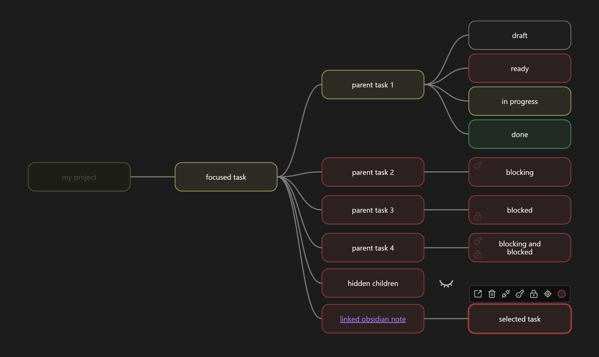

# Obsidian Taskmap Plugin

Visualize your project as a tree of automatically positioned tasks.

## Why Taskmap?

Get your project state at a glance.

Large Kanban boards overwhelm. Taskmap's color-coded tree instantly shows:
- Blocked areas
- Progress status
- Dependency flow

Canvas-style visualization, zero manual positioning.

## Key Features

- Automatic parent status from children
- Color-coded status visualization
- Tree restructuring via reparenting
- Blockers/dependencies
- Hide irrelevant branches
- Link tasks to obsidian notes for rich description
