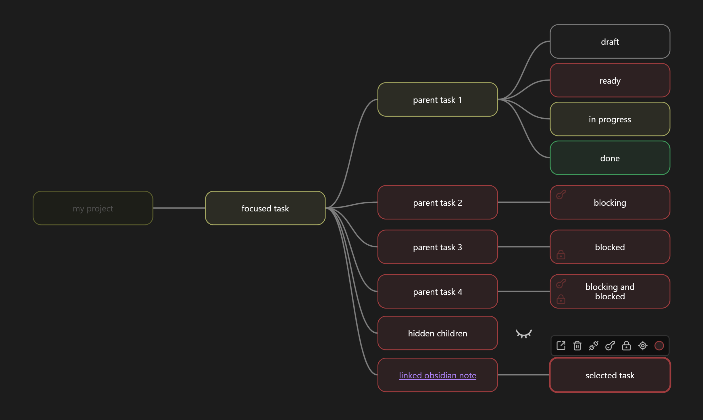

# Taskmap

Plan projects as visual task trees in Obsidian.
Taskmap lays out the tree automatically, so you never have to drag boxes around to keep it readable.



**Draft** is gray, **Ready** is red, **In progress** is yellow, and **Done** is green.

## Why Taskmap?

Large Kanban boards get hard to read. Taskmap shows your project as a color-coded tree, so you can see at a glance:

- Which tasks are done, in progress, or ready to start
- Which tasks are blocked, and by what
- How the work breaks down from goals into subtasks

## How to install

Install Taskmap from its [Obsidian plugin page](https://community.obsidian.md/plugins/taskmap), or open **Settings → Community plugins → Browse** in Obsidian and search for **Taskmap**.

Obsidian Sync skips `.taskmap` files by default. To sync them, turn on **Sync all other types** in **Settings → Sync** on each device.

## How to use

- Click the Taskmap ribbon icon or run **Taskmap: Create new map** from the command palette to create a map in the vault root. To create one in a specific folder, right-click the folder in the file explorer and click **New taskmap**. The map is named like `Example_26-10-10_03.44.12.taskmap`, with `_1`, `_2`, and so on added if that name is taken, and opens in a new tab.
- Hover a task and click **+** to add a child. The new task is named `task` and starts as **Ready**.
- Select a task to open its toolbar. Hover a toolbar button to see its name.
- Select a task, then click its name to rename it.
- Drag a task vertically to reorder it among its siblings.
- Hover a task and click the eye icon to hide its children.

## Feature reference

### Root task

Every map starts with a task named `root`, with status **Draft**. Like any parent set to **Draft**, it stays a draft after you add children, until you click its calculated status in its **Status** menu. Rename it to your project's name. The root can't be reparented, removed, or used as a blocker.

### Rename a task

Select a task, then click its name. Press **Escape** or click somewhere else to apply the name. **Enter** adds a line break. This works the same way for every task, including the root.

Long names wrap, and the box grows with the text. The tree lays itself out again to fit.

### Pan and zoom

Drag an empty area of the map with the left or middle mouse button to pan. Scroll with a mouse wheel or touchpad to zoom, from 10% to 300%.

### Statuses

Each task has one of four statuses: **Draft**, **Ready**, **In progress**, or **Done**. The colors are listed under the screenshot.

To change a status, select the task, then click **Status** in its toolbar and choose a status.

Leaf tasks (tasks without children) can be set to any status. A parent task's status is calculated from its children:

- **Done** if all children are done
- **In progress** if at least one child is done or in progress
- **Draft** if all children are drafts
- **Ready** otherwise

A parent's **Status** menu offers only **Draft** and its calculated status. A parent set to **Draft** stays a draft whatever its children do, until you click its calculated status again.

### Blockers

Select a task, then:

- Click **Add blocker task**, then click the task that blocks the selected one.
- Click **Block another task**, then click the task that the selected one blocks.

Press **Escape** or click an empty area to cancel.

While **Add blocker task** or **Block another task** is active, click a task that is already connected to remove that connection. A task can't be connected to itself, to an ancestor, to a descendant, or to a task that is **Done**.

A blocked task cannot be marked done until all its blockers are done. A key icon marks a task that blocks others, and a lock icon marks a task that is blocked.

Blocker connections are drawn as orange lines. They appear while **Add blocker task** or **Block another task** is active, and when you hover a task's icons:

- Hover the key icon to highlight the tasks it blocks.
- Hover the lock icon to highlight the tasks that block it.

### Move a task to another parent

Select a task, click **Reparent**, then click the new parent on the map. The task moves with all its children. The new parent can't be the task itself, its current parent, or one of its descendants. Press **Escape** or click an empty area to cancel.

### Remove tasks

Select a task, click **Remove** in its toolbar, then choose:

- **Remove single task** removes only the selected task. Its children move up and take its place under its parent.
- **Remove task branch** removes the selected task and all its descendants.

Pressing **Delete** removes the selected task the same way as **Remove single task**.

### Hide and focus

Hide collapses a task's descendants. Hidden tasks stay in the file; click the eye icon again to show them.

Focus temporarily shows only the selected branch and its ancestors; click **Focus** again to return to the full map.

### Linked notes

Click **Add link** to create a note named after the task and link the two. If a note with that name already exists, it's linked instead.

New notes go to the project's note folder, then the plugin's default note folder. If neither is set, they follow Obsidian's **Default location for new notes** setting.

To link an existing note, type `[[` in the task name and choose a note from the suggestions. Typing `[[Meeting notes]]` renames the task to that note and links it. Press **Tab** to choose the highlighted suggestion.

Click the link while the task is not selected to open or focus the note. Hover the link to show Obsidian's link preview. If the task is already selected, clicking its name starts editing, and the link is not followed.

Once a task is linked to a note:

- Renaming the note renames the task.
- Moving the note or renaming its folder keeps the link.
- Deleting the note removes the link; the task keeps its name.
- Renaming the task breaks the link; the note is left unchanged.

A task name can also be any Markdown link, such as `[Design doc](https://example.com/design)`.

### Undo and redo

Use the undo and redo controls in the bottom-left corner of the map, or press **Ctrl+Z** to undo and **Ctrl+R** to redo. The shortcuts use Ctrl on macOS too.

Undo history is cleared when you close the file.

### Settings

Plugin settings are in **Settings → Taskmap**:

- **Theme**: **Obsidian** (default) uses the active Obsidian theme's red, yellow, and green, and its faint text color for drafts, so community themes can change the exact shades. **Light** and **Dark** force Taskmap's own light and dark shades.
- Zoom sensitivity, set separately for mouse and touchpad
- Default folder for linked notes

Project settings override the note folder for a single map. To open them, click **Settings** next to the undo and redo controls.

## Files

A `.taskmap` file is JSON stored in the vault. Rename or move it in the file explorer; an open map follows the file.

Obsidian Sync skips `.taskmap` files unless **Sync all other types** is turned on in **Settings → Sync**.

## Current limitations

- Works only in the Obsidian desktop app.
- Has no sharing or collaboration features.
- Tasks have no due dates or assignees.
- Tasks are stored only in the `.taskmap` file and don't sync with Markdown checkboxes or task plugins.
- The interface is available only in English.

## Bugs and missing features

- **A parent can get stuck as Draft.** When all of a parent's children are drafts, the parent becomes **Draft** automatically and then stops updating: changing a child's status or adding a child doesn't change it. To fix it, click the parent's calculated status in its **Status** menu.
- **No mobile support.** Taskmap works only in the desktop app. Support for Obsidian on phones and tablets is planned.
- **Documentation is incomplete.** Some behavior isn't described here yet. If something is unclear, [open an issue](https://github.com/poanse/obsidian-taskmap/issues).

## Development

Clone the repository into your vault's `.obsidian/plugins/` folder, then install dependencies and start the watcher:

```bash
npm install
npm run dev
```

Enable Taskmap in **Settings → Community plugins**, and reload Obsidian after each rebuild to load the changes.

Other commands:

```bash
npm run build
npm test
npm run lint
npm run perf:tasks
```

`npm run dev` rebuilds the plugin as you edit. `npm run build` writes a production `main.js`. `npm test` runs the tests. `npm run lint` runs the linter. `npm run perf:tasks` benchmarks task lookup and layout.

## Links

- [Obsidian plugin page](https://community.obsidian.md/plugins/taskmap)
- [Report an issue](https://github.com/poanse/obsidian-taskmap/issues)
- [Source code](https://github.com/poanse/obsidian-taskmap)
- [License](https://github.com/poanse/obsidian-taskmap/blob/master/LICENSE)
- [Buy me a coffee](https://www.buymeacoffee.com/poanse)
